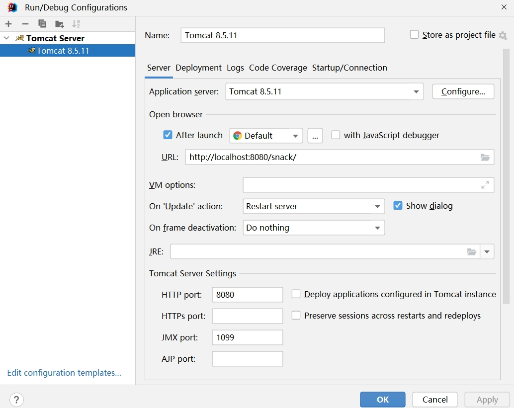
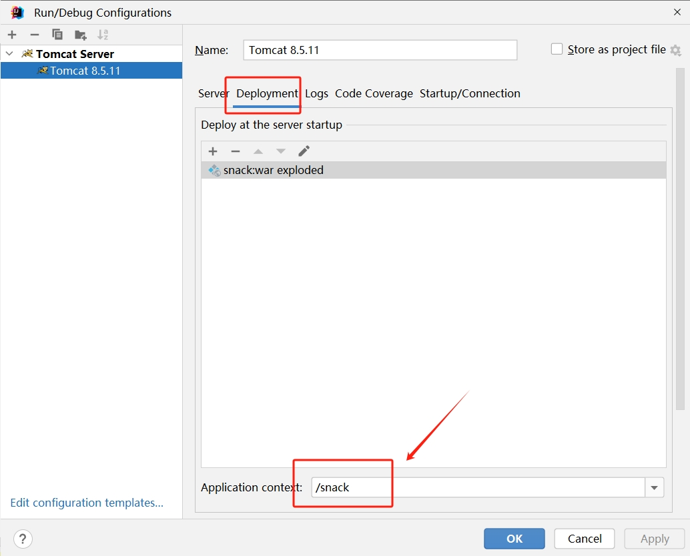
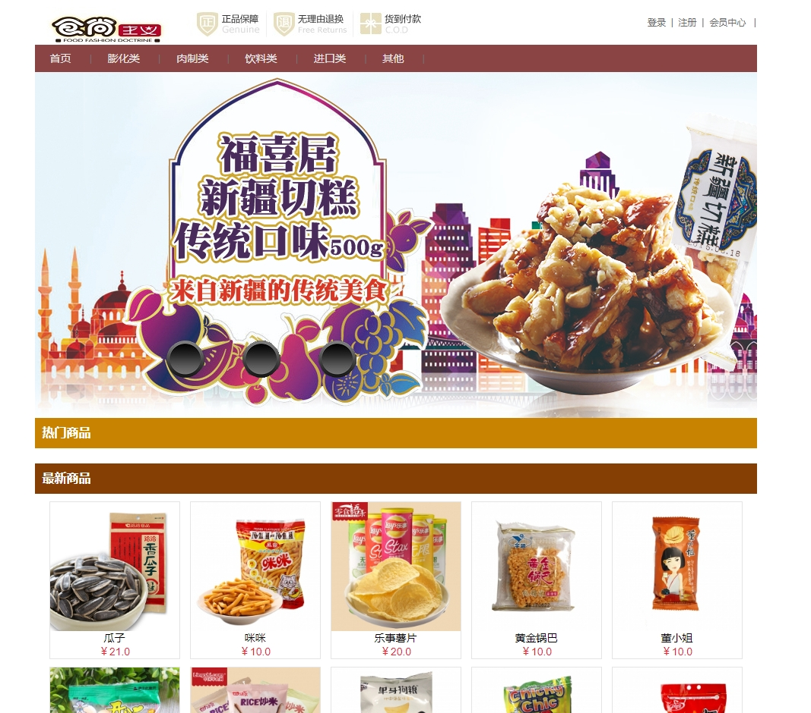
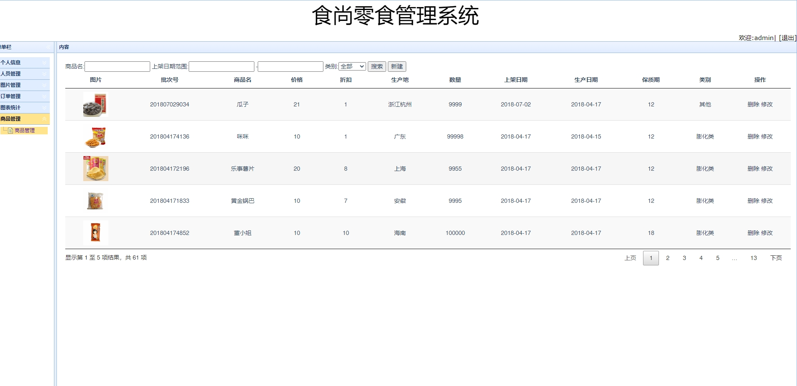

 **郑重声明：项目经过本地测试，确保可以运行， 可以用于学习和毕业设计参考~** 
**扫码 >> 源码商城 获取** 

#### 1.项目介绍

- 基于SSM的零食商城系统，前端采用Bootstrap框架。

- 后台采用经典SSM框架。数据库采用MySQL。

- 包括用户前台和管理后台，后台管理又可以分为店员（或客服）和超级管理员，

- 会员可以通过商城门户进行查看商品、选购、支付、确认收货。客服只能进行普通操作，比如发货。管理员可以进行后台全部操作。

- 运行环境:IDEA2022+jdk1.8+MySQL5.7+Tomcat8 

#### 2.本地部署

- 下载项目，用IDEA打开项目。

- 查看src/config/jdbc.properties，根据自己的环境修改数据库名称，数据库账号密码。

- 添加Tomcat Local server，运行Tomcat，Tomcat配置如下，一定要注意路径的配置。

- 运行门户网站：http://localhost:8080/snack/shop/index  注意：路径需要和我配置的一致哦~

- 后端管理页面：http://localhost:8080/snack/admin/login/adminLogin 管理员账号： admin/123456   客服账号：客服、123456

